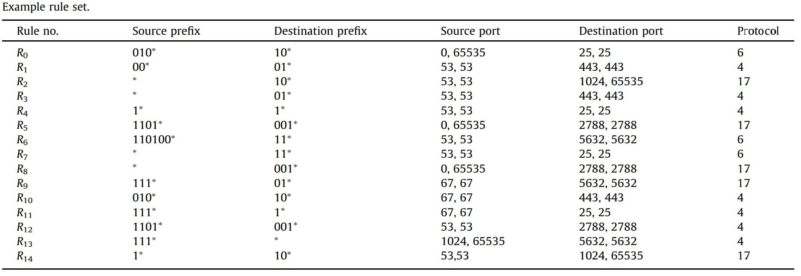
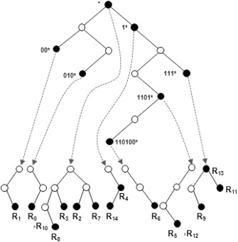
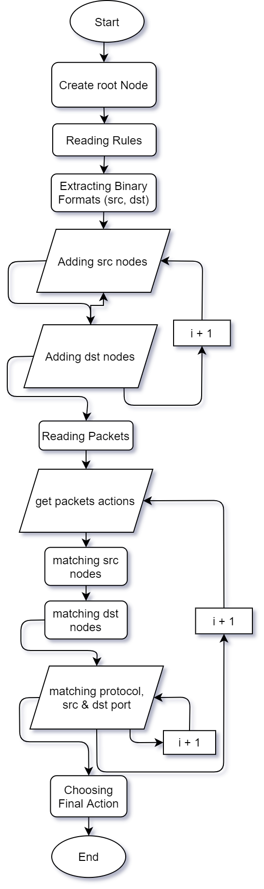

# SAR - Packet Classification Hierarchical Based Algorithm
Switching and Routing - Packet Classification Hierarchical Based Algorithm

### Introduction
Packet classification is employed by Internet routers to implement many advanced Internet services, such as routing, rate limiting, access-control in firewalls, virtual bandwidth allocation, policy-based routing, service differentiation, load balancing, traffic shaping, and traffic billing. Each of these services requires the router to classify incoming packets into different flows and then perform appropriate actions depending upon which flow the incoming packet has been identified to fall into. These flows, or classes, are specified by a classifier. A classifier is a set of filters or rules. For instance, each rule in a firewall could specify a set of source and destination addresses, and associate a corresponding ‘deny’ or ‘permit’ action with it. Or the rules could be based on several fields of the packet including layers 2, 3, 4, and maybe 5 addressing and protocol information.

The simplest and most well-known form of packet classification is used in routing IP datagrams, where each rule specifies a destination prefix. The associated action is the IP address of the next-hop where the packet needs to be routed to. The classification process requires determining the longest prefix which matches the destination address of the packet.

### Generic Packet Classification
Generic packet classification requires the router to classify a packet based on multiple fields in its header. Each rule of the classifier specifies a class (For example, each rule in a flow classifier is a flow specification, where each flow is in a separate class.) that a packet may belong to based on some criteria on F fields of the packet header, and associates with each class an identifier, class ID. This identifier uniquely specifies the action associated with the rule. Each rule has F components. The i-th component of rule R, referred to as R[i], is a regular expression on the i-th field of the packet header. (In practice, the regular expression is limited by syntax to a simple address/mask or operator/number(s) specification.) A packet P is said to match a particular rule R, if whatever i, the i-th field of the header of P satisfies the regular expression R[i].

The classes specified by the rules may be overlapping i.e. one packet can match several rules. Without loss of generality, we will assume throughout this paper that when two rules overlap, the order in which they appear in the classifier will determine their relative priority. In other words, a packet which matches multiple rules will belong to the class identified by the class ID of the rule R, if R is the first among all the rules the packet matches in the classifier. The rule list table and its tree can be seen as follows:





### Requirements:

This application has been developed and tested with Python 3.7.9. Using other versions may result in errors since Python is not backward compatible.

### Python Packages
```
import random
import sys
import time
```

### Program Packages
```
import network_utils as nu
import binary_tree as bt
```

### Generating Random Rule List
```
python rules_generator.py
```
This will generate 32 separate random lists each one of them with 100 entries and having the same prefix. Example: Rule24.txt contains 100 random rules with prefix /24.

### Generating Random Incoming Packets
```
python packet_generator.py
```
This will generate a long list of incoming packets with 100k entries. If both the rules and packets are generated randomly there would be no match, even with having the lower prefixes we may have matches in the source and destination IP addresses but not the protocol and port numbers would be different. To avoid this randomness and get a match we can use rules with having <code>*</code> value for their protocol and port numbers. If we want to get more matches the <code>rules_to_packet.py</code>  can be used to extract the entries from the rule list and creating a special packet list which will result in 100% matches.

### Extracting Packets from Random Rule List
```
python rules_to_packet.py
```
Extracting the entries from the rule list and creating a special packet list which will result in 100% matches.

### Building Manual Rule List
This can be achieved by creating a text file and following the format below for each entry in the rule list:
```
Source_NetID, Destination_NetID, Protocol_Number, Source_Port_Number, Destination_Port_Number, Action
```
An example of rule list entries would be as follows:
```
27.1/16,            16.1.1/20,          9,      8080,       443,    ALLOW
192.168.1.1/27,     10/8,               220,    1234,       57,     DENY
*,                  *,                  *,      *,          *,      DENY
```
As can be seen in the example, the rule list is dynamic and can contain various NetIDs with different lengths. The <code>*</code> character can be used in any fields but not in the action field (otherwise in the output you will get the action: * which doesn't make any sense.) The only thing that should be taken into account is yo use real-world scenario values for the fields. Below you can see the different sizes of each field.
```
IP ADDRESS      X.X.X.X                                 32bits      X from 0 to 255
NET_ID          X/S or X.X/S or X.X.X/S or X.X.X.X/S    1-32bits    X= [0-255] and S=[1-32]
PROTOCOL        X                                       8bits       X=[0-255]
PORT            X                                       16bits      X=[0-65535]
```
### Building Manual Packet List
This can be achieved by creating a text file and following the format below for each entry in the packets list:
```
Source_IP, Destination_IP, Protocol_Number, Source_Port_Number, Destination_Port_Number
```
An example of packets list entries would be as follows:
```
172.168.1.1,            16.1.1.17,          9,      8080,       443
192.168.1.1,            211.14.176.250,     220,    1234,       57
```
As can be seen in the previous example, the packets list has some differences compared to the rule list. Instead of NetID we have an IP address and there is no Action field and also the <code>*</code> character cannot be used. If you are going to build a packet list by copying entries of rule list into the packet list be aware of these differences and since the NetID has various lengths you may add extra random octets to convert it to an IP address.

### Output and Results

#### Average Time
There are different options available for the output of the program. If you run the program, by default it will give you the total number of packets that have been classified along with the total and average classification time. An example is as follows:
```
It took 543824000 ns to classify 100.000 packets
The average time for each packet is 5438 ns
```

#### Match results
Another output can be the match result which shows the packet and corresponding matched rule information with its priority number.
```
Packet>>  sIP: 175.148.184.93       dIP: 134.136.54.152         protocol: 199   sPort: 45282    dPort: 20830   
Rule>>    sIP: 175.123.56.239/8     dIP: *                      protocol: *     sPort: *        dPort: *        action: ALLOW       Priority: 66

Packet>>  sIP: 48.218.45.175        dIP: 7.80.81.103            protocol: 44    sPort: 53993    dPort: 6119   
Rule>>    sIP: 48.200.235.197/8     dIP: *                      protocol: *     sPort: *        dPort: *        action: ALLOW       Priority: 55

Packet>>  sIP: 111.162.29.188       dIP: 72.182.74.120          protocol: 215   sPort: 1097     dPort: 19979   
Rule>>    sIP: 111.33.97.167/8      dIP: *                      protocol: *     sPort: *        dPort: *        action: DENY        Priority: 96

Packet>>  sIP: 193.211.61.169       dIP: 140.102.86.244         protocol: 221   sPort: 13437    dPort: 48490   
Rule>>    sIP: 193.201.250.144/8    dIP: *                      protocol: *     sPort: *        dPort: *        action: DENY        Priority: 1
```
To see such a result you have to uncomment the last lines in the <code>binary_tree.py</code>. The code for this part is in the last secon inside <code>get_packets_actions</code> method.
```
# Match Results 
print(
    "Packet>> ".ljust(10) +
    "sIP: %s".ljust(20) % (packet.src_ip) + 
    "dIP: %s".ljust(20) % (packet.dst_ip) +
    "protocol: %s".ljust(14) % (packet.protocol) +
    "sPort: %s".ljust(12) % (packet.src_port) +
    "dPort: %s".ljust(12) % (packet.dst_port) +
    "\n" +
    "Rule>>".ljust(10) +
    "sIP: %s".ljust(20) % (final_rule.src_sub) + 
    "dIP: %s".ljust(20) % (final_rule.dst_sub) +
    "protocol: %s".ljust(14) % (final_rule.protocol) +
    "sPort: %s".ljust(12) % (final_rule.src_port) +
    "dPort: %s".ljust(12) % (final_rule.dst_port) +
    "action: %s".ljust(20) % (final_rule.action) +
    "Priority: %s" %(str(sorted(final_actions)[0]+1)) +
    "\n")
```

#### Draw The Tree
This is very usefull to better understand how the program works and see the structure of the tree. In order to enable this you have to uncomment <code>bt.show(root)</code> in <code>main.py</code> which will draw the binry tree starting from root node. Consider the following rule list:
```
49.152.167.217/3,136.12.186.201/3,*,*,*,DENY
63.206.91.134/3,70.151.189.71/3,*,*,*,DENY
200.60.253.189/3,136.214.107.103/3,*,*,*,DENY
146.214.87.81/3,217.117.191.86/3,*,*,*,DENY
132.102.112.165/3,127.38.147.223/3,*,*,*,ALLOW
95.233.232.154/3,90.139.190.111/3,*,*,*,DENY
150.175.131.154/3,212.133.62.188/3,*,*,*,DENY
11.232.110.114/3,108.231.91.220/3,*,*,*,ALLOW
250.144.74.124/3,71.110.135.38/3,*,*,*,ALLOW
61.213.218.131/3,239.138.34.227/3,*,*,*,DENY
```

The output binary tree would be:
```
value = ^
  |--value = ^1
  |  |--value = ^11
  |  |  |--value = ^111
  |  |  |  |--value = #
  |  |  |    |--value = #0
  |  |  |       |--value = #01
  |  |  |         |--value = #010
  |  |  |           |--value = $, rules: [8]
  |  |  |--value = ^110
  |  |    |--value = #
  |  |       |--value = #1
  |  |         |--value = #10
  |  |           |--value = #100
  |  |             |--value = $, rules: [2]
  |  |--value = ^10
  |    |--value = ^100
  |      |--value = #
  |        |--value = #1
  |        |   |--value = #11
  |        |     |--value = #110
  |        |       |--value = $, rules: [3, 6]
  |        |--value = #0
  |           |--value = #01
  |              |--value = #011
  |                |--value = $, rules: [4]
  |--value = ^0
    |--value = ^01
    |  |--value = ^010
    |    |--value = #
    |      |--value = #0
    |         |--value = #01
    |           |--value = #010
    |             |--value = $, rules: [5]
    |--value = ^00
      |--value = ^001
      |  |--value = #
      |    |--value = #1
      |    |  |--value = #10
      |    |    |--value = #100
      |    |      |--value = $, rules: [0]
      |    |--value = #0
      |       |--value = #01
      |         |--value = #010
      |           |--value = $, rules: [1]
      |--value = ^000
        |--value = #
          |--value = #0
             |--value = #01
                |--value = #011
                  |--value = $, rules: [7]
```
The translation of the signs that were used for drawing the tree is as follows:
```
^       First  Tier (Field 1) Root Node
^X      First  Tier (Field 1) Node          X is the binary prefix number which grows by moving deeper into the tree
#       Second Tier (Field 2) Root Node
#X      Second Tier (Field 2) Node          X is the binary prefix which grows by moving deeper into the tree
$       Second Tier (Field 2) End Node
[X]     The Matched Rule index              X+1 = Priority number in the rule list
```

#### Output as a Text File
The best way to use the results as a report for further analysis and investigations is to save the output of the program into a text file.
```
python main.py rule_list.txt packets.txt > Report_XX.txt
```

### Running the program
The program has two input arguments, the rule list, and the packet list, both are necessary for the functionality of the program.
```
python main.py rule_list.txt packets.txt
```

### Flow Chart of the program
The general flow chart of the prgram can be see in summary.


### References

#### Books
- High-Performance Switches and Routers, Wiley, H. Jonathan Chao, and Bin Liu
- Python Pocket Reference, O'REILLY, Mark Lutz

#### Videos
- [Professor Guido Maier - Packet Classification (Intro, Hierarchical Tries)](https://youtu.be/S0vqw2elg7s)
- [Corey Schafer - Python OOP Tutorials](https://www.youtube.com/channel/UCCezIgC97PvUuR4_gbFUs5g)

#### Websites
- [W3Schools - Python Tutorial](https://www.w3schools.com/python/default.asp)
- [Coursera - Python Data Structure](https://www.coursera.org/learn/python-data)
- [University of California Berkeley - CS61B: Data Structures and Advanced Programming by Paul N. Hilfinger](https://inst.eecs.berkeley.edu/~cs61b/fa14/)
- [University of Pennsylvania - Backtracking by David Matuszek](https://www.cis.upenn.edu/~matuszek/cit594-2012/Pages/backtracking.html)
- [IEEE Stanford University - Packet Classification using Hierarchical Intelligent Cuttings by P. Gupta and N. McKeown](http://www.academia.edu/download/32951877/HOTI_99.pdf)
- [Elsevier - A new hierarchical packet classification algorithm by Hyesook Lim, Soohyun Lee, Earl E.SwartzlanderJr.](https://www.sciencedirect.com/science/article/pii/S1389128612001545?via%3Dihub#b0005)